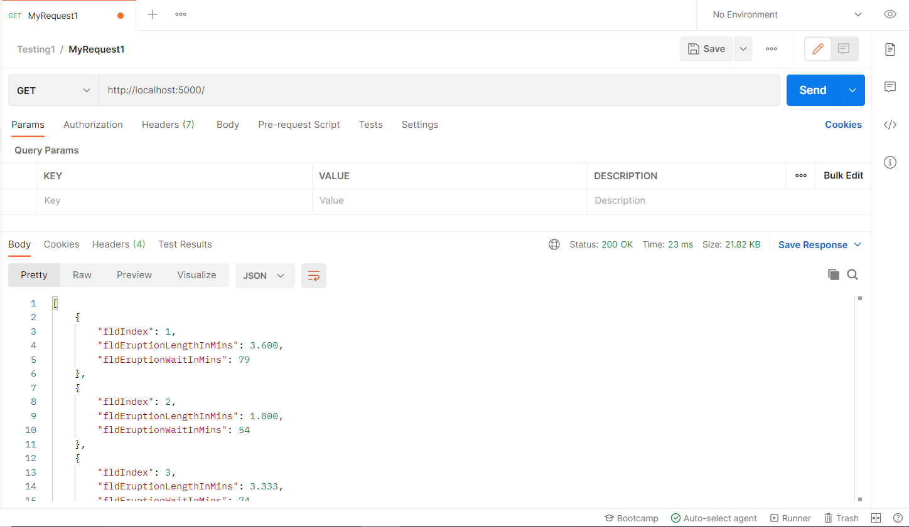

# Project Description
This project is a homework assignment to learn how to get PyCharm setup with Docker, Flask, MySQL and Postman using your own Dataset.

# Postman Screenshot

# SQL Data Screenshot
