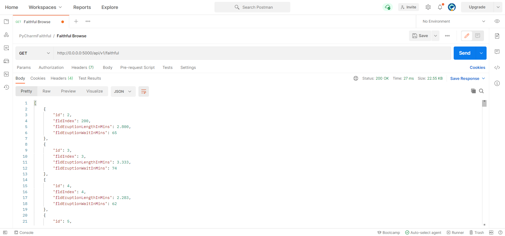
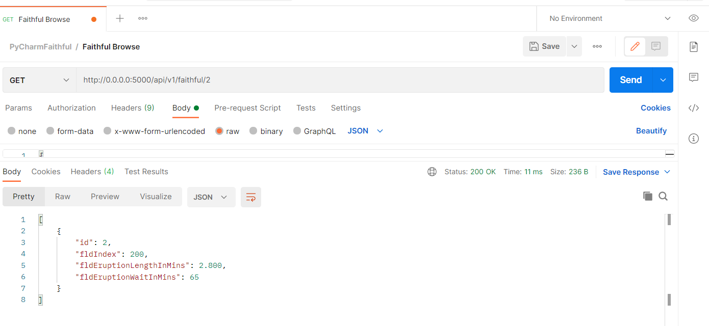
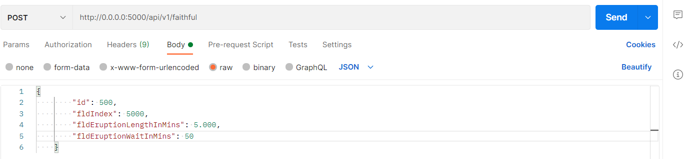
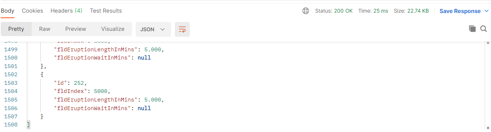
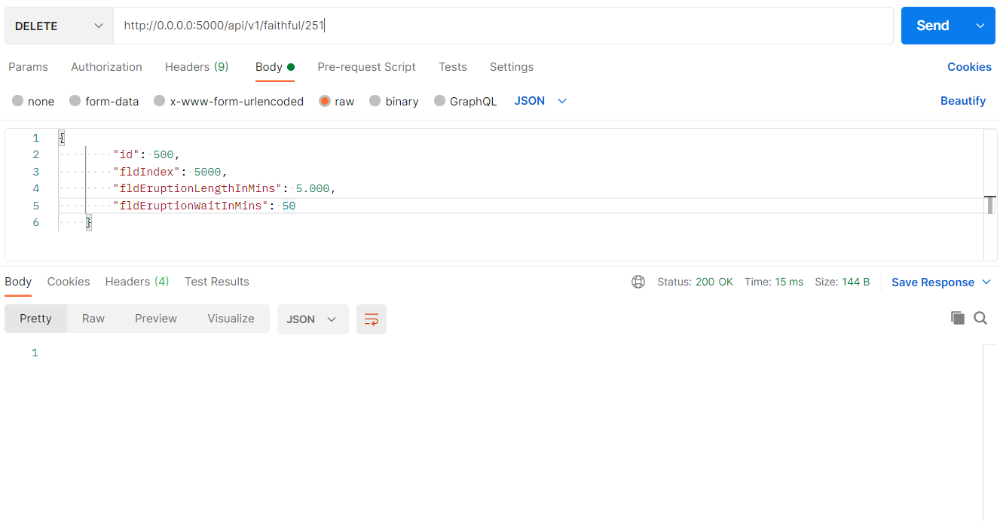
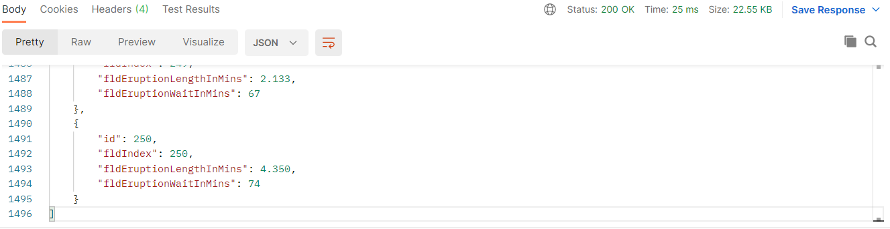

# Project Description
This project is a homework assignment to learn how to get PyCharm setup with Docker, Flask, MySQL and Postman using your own Dataset.

# Postman Screenshot

# SQL Data Screenshot

# Project Screenshots:

## a. Viewing project data tables in PyCharm:

## b. Project running in the browser displaying the homepage with the data:

## c. Project running in the browser displaying the data record as a view of one record:

## d. Project running in the browser displaying a new record added to your home page:
### i. Blank form for a new entry:

### ii. Form for new entry with all data fields filled:

### iii. New entry added (see last record):

## e. Project running in the browser displaying an updated record added to the home page:
### i. Form for updating (editing) a record with all data fields filled:

### ii. Updated (Edited) record (see first record):

## f. Project running in the browser displaying a deleted record added to the home page:
### i. Record to be deleted (see last record):

### ii. Last record deleted:

##g. The project showing postman listing all records.

##h. The project showing postman showing one record with a get request.

##i. The project showing postman creating a record by showing the post request and the results in the record listing. 

##j. The project showing postman edit a record by showing the put request and the results in the record listing. 

##k. The project showing postman delete a record by showing the delete request and the results in the record listing.

